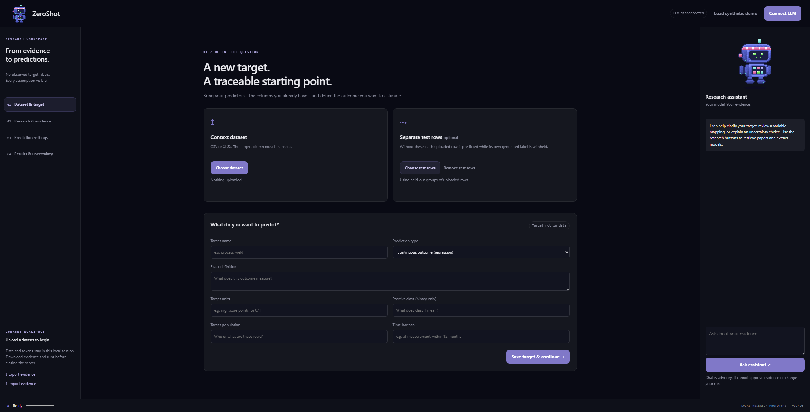
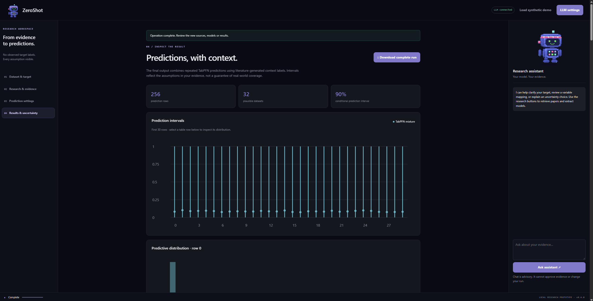

# ZeroShot: agent-assisted transfer learning for TabPFN

A general-purpose transfer-learning framework for TabPFN, designed for tabular prediction with **zero observed target labels in the supplied context**. LLM agents search the literature, extract coefficients and their reported uncertainties, and propose candidate models. Monte Carlo sampling—repeatedly drawing plausible model parameters—turns those models into alternative labeled context datasets. TabPFN uses each dataset as examples for predicting test rows, without retraining or changing its pretrained weights. The final prediction combines the resulting TabPFN predictive distributions.

**Status: research-stage proof of concept.** The pipeline is implemented and has been tested on an initial example, but its general effectiveness and uncertainty estimates have not yet been established. The framework transfers external knowledge through generated labels and is intended for use across application domains. The current implementation supports regression (numeric outcomes) and binary classification (two possible outcomes), using linear or logistic label-generating models. Generalization across domains and uncertainty calibration—whether stated uncertainty agrees with observed errors—remain to be evaluated. Credit default is an initial testing example, not the framework's scope. This project is independent of Prior Labs.

## 1. Install and start

You need Python 3.11 or newer. Download and extract the repository, or clone it, then open a terminal in the folder containing `pyproject.toml` and this README. The commands below create a virtual environment—a separate folder for this project's Python packages—and install the app with TabPFN.

### Windows PowerShell

Run each command separately:

```powershell
py -3 -m venv .venv
```

```powershell
.\.venv\Scripts\python.exe -m pip install -e ".[tabpfn]"
```

```powershell
.\.venv\Scripts\python.exe -m zeroshot.web
```

### Linux or macOS

```bash
python3 -m venv .venv
```

```bash
.venv/bin/python -m pip install -e ".[tabpfn]"
```

```bash
.venv/bin/python -m zeroshot.web
```

Open **http://127.0.0.1:7432** and leave the terminal running. The app serves only your local computer. On subsequent visits, run just the final start command from the same folder.

TabPFN runs locally. Its model weights may require a first-use download, authentication or acceptance of upstream model terms. Installing the Python package does not guarantee access to those weights. A local checkpoint—the file containing the pretrained model weights—can also be specified in **Prediction settings**. No separate hosted TabPFN service token is required by this interface.

## 2. Upload inputs and define the target



*Dataset & target: upload the columns you have and describe the outcome you want to predict.*

In **Dataset & target**:

1. Click **Choose dataset** to upload a UTF-8 CSV or XLSX file. Each row is one example and each column is an input variable. Column names must be unique. **Remove the target column completely**, rather than leaving it blank.
2. Optionally click **Choose test rows** to upload the rows you want predictions for. Include the input columns required by your chosen models and TabPFN settings.
3. Enter the target name, prediction type, exact definition, units, population and time horizon. For a binary target, explain which outcome is class **1**.
4. Click **Save target & continue**.

The context dataset supplies the input rows for which the literature models generate example labels. The test dataset supplies the rows TabPFN predicts. Without a separate test file, the application predicts uploaded rows in held-out groups: a row's own generated label is excluded from the context used to predict it.

If you have real target labels for evaluation, keep them in a separate file and outside the research and prediction workflow.

## 3. Connect your LLM

Click **Connect LLM**, select a supported protocol, and enter a model identifier available through your provider. Supply your API token and review the data-sharing checkbox before testing the connection.

| Connection | What to enter |
| --- | --- |
| OpenAI-compatible provider | Provider base URL, usually ending in `/v1`, model identifier and token. The app adds `/chat/completions`. |
| Anthropic | Model identifier and API token; the app uses its native Messages API. |
| Google Gemini | Model identifier and API token; the app uses its native `generateContent` API. |
| Local Ollama | Select OpenAI-compatible and use `http://127.0.0.1:11434/v1`, with a model already installed in your running Ollama service. |

The connection test makes a real request. Provider charges and usage limits apply. The LLM receives target descriptions, column summaries, source excerpts and your questions; individual uploaded rows are not sent. Summaries can still contain sensitive information. Tokens stay in the local server session and are excluded from downloads.

## 4. Find evidence and build models

Open **Research & evidence**. For the delegated workflow, select **Full handoff: research, propose, review and predict**. You can leave **My model instructions** blank, or describe preferred predictors, equations, parameter values or models to avoid.

The application coordinates four agent roles through your connected LLM. An agent here is an LLM given a particular task within the workflow:

| Role | Task |
| --- | --- |
| Researcher | Find relevant papers when no sources have been supplied, reuse saved papers, and screen sources. |
| Extractor | Extract usable equations, coefficients, uncertainty estimates, variable definitions and transformations. |
| Model proposer | Suggest linear or logistic models when published equations are insufficient or you request custom models. |
| Reviewer | Critique proposed models and provide feedback for a limited revision step. |

These roles run sequentially using the same LLM connection. The backend checks model format and compatibility with your columns afterward; these checks do not establish scientific validity.

You can hand off discovery and modeling with **Run everything for me**, after checking the prediction settings in the next section. To inspect sources first, use **Find papers for me**, review the candidates, and approve or reject them. Use **+ Add paper or text** to supply your own sources. Saved sources are reused and rejected sources stay excluded.

Choose **Published equations only: do not estimate missing numbers** if you want to exclude proposed numerical assumptions. In full-handoff mode, estimated coefficients and uncertainty ranges are explicitly labeled as assumptions, even when a paper motivates the model. Without eligible sources, proposals are labeled as unsourced LLM priors—assumptions supplied by the LLM without supporting source evidence.

To inspect models before prediction, click **Suggest models without running TabPFN**. The optional model editor also supports entering exact models yourself. Inspect preparation messages for incompatible variables, missing information or excluded rows. If evaluating a benchmark, configure its dataset names under **Advanced: dataset exclusions and source screening** before research; screening cannot guarantee independence from model pretraining.

## 5. Configure and run predictions

Open **Prediction settings** before starting the full run.

| Setting | How to use it |
| --- | --- |
| Prediction paths | Select **Literature context labels → repeated TabPFN predictions** for the main workflow. |
| Plausible datasets / Monte Carlo draws | Each draw creates another set of generated context labels and another TabPFN prediction. Start with 4–8 for a small trial; increase after the trial succeeds. |
| Context limit | Controls how many example rows TabPFN receives. Smaller contexts can reduce memory use. |
| Device | Select CPU or a supported GPU. GPU memory requirements depend on the model and context size. |
| Interval level | Sets the reported prediction range, such as 90%. This is conditional on the chosen evidence and assumptions, not a demonstrated coverage guarantee. |

Return to **Research & evidence** and click **Run everything for me** to build the models and run predictions. If models are already prepared, use **Validate evidence** and **Generate predictions** in Prediction settings. Review any reported failures or skipped models rather than treating a completed run as scientific validation.

During each Monte Carlo draw—one random choice of plausible parameters—the equations label the context rows. TabPFN then predicts the test rows using that generated context. The final output averages these TabPFN predictive distributions; it does not mix direct literature predictions into the final answer. More draws improve the precision of this averaging, but do not remove uncertainty in the underlying evidence.

## 6. Inspect and download results



*Results & uncertainty: an example completed run with 256 prediction rows and 32 sampled context datasets.*

Open **Results & uncertainty** to inspect the prediction table and charts. Select a table row to view its distribution of possible outcomes.

- For numeric outcomes, inspect the prediction and its interval in the target's units.
- For binary outcomes, the mean is the predicted probability of class **1**. An interval for the eventual 0/1 outcome may span both 0 and 1, as in the screenshot. This differs from the spread of predicted probabilities across sampled contexts.
- The reported uncertainty combines the average uncertainty within individual TabPFN predictions and disagreement between their means. Its reliability depends on the evidence, modeling assumptions and TabPFN behavior.

Click **Download complete run** to save the results:

| File | Contents |
| --- | --- |
| `predictions.csv` | Row positions, predictions, intervals and uncertainty summaries. |
| `predictive_distributions.npz` | Numerical predictive samples and per-draw summaries, readable with NumPy. |
| `audit.json` | Settings, assumptions, sampled parameters/context labels, data hashes and software versions. |
| `evidence.json` | Model definitions and supporting excerpts. |
| `research_log.json` | Search, retrieval and extraction records. |

For binary runs, `*_mean` is the class-1 probability. `*_lower` and `*_upper` concern the future 0/1 outcome. `*_probability_lower` and `*_probability_upper` summarize variation in predicted probability across worlds; they are not automatically calibrated confidence intervals.

## Save and resume

Before closing the app, use **Save research workspace** in Research & evidence and download any completed run. Keep your original input files separately: exports do not contain raw uploaded datasets or API credentials.

To resume, start the app, reload the input datasets, import the saved workspace through **Import evidence**, reconnect your LLM if needed, and review the imported models and prediction settings. Workspace imports reset model approval. Sessions disappear when the server stops and expire after eight idle hours; there is no automatic recovery of unsaved work.

## Try the interface without credentials

In a fresh session, click **Load synthetic demo**. It supplies fictional data and a fictional model without calling an LLM. Inspect and approve the demonstration model, then use **Validate evidence** and **Generate predictions**.

The demo initially selects a direct-equation diagnostic so it can run without TabPFN weights. It is an interface demonstration, not the full transfer-learning pipeline or evidence of real-world accuracy. To exercise the full pipeline, select the repeated-TabPFN path after obtaining model access. If installing only for the offline demo, use `"."` in place of `".[tabpfn]"` above.

## Example: credit default

To try a masked-label example, follow the [credit data walkthrough](docs/CREDIT_EXAMPLE.md). Credit default is a demonstration domain, not a restriction on the framework.

An initial run used 512 context rows, 256 test rows and 32 sampled contexts. It achieved ROC AUC 0.6987 (a measure of how well predictions rank the two classes), but underestimated average default risk: 13.99% predicted versus 20.31% observed. Its three label-generating models used **LLM-proposed numbers**, not complete published fitted equations. See [the experiment report](docs/EXPERIMENT.md) for the full results and limitations. This single experiment does not establish general accuracy, reliable uncertainty intervals, or improvement from TabPFN over the equations alone.

## How the predictions are combined

Let $X_C$ be unlabeled context covariates, $x_{\ast}$ a test row, and $E$ the accepted evidence plus explicitly declared assumptions. A world is one sampled scenario. In world $m$, $J_m$ identifies the chosen equation, $\theta_m$ contains its sampled parameters, and $\tilde{y}_C^{(m)}$ denotes the generated context labels:

$$
(J_m,\theta_m)\sim\pi(J,\theta\mid E),\qquad \tilde{y}_C^{(m)}\sim p_{J_m,\theta_m}(\cdot\mid X_C).
$$

For binary targets this means Bernoulli draws from a sampled logistic equation. For regression the default uses the sampled equation's conditional means; sampling noisy outcomes is optional. Thus the regression default deliberately differs from drawing full outcomes above.

TabPFN uses those labeled examples without changing its pretrained weights. Its predictive distribution in world $m$ is $q_m$; averaging over $M$ worlds gives $\hat{q}$:

$$
q_m(y_{\ast}\mid x_{\ast})=q_{\mathrm{PFN}}(y_{\ast}\mid x_{\ast},X_C,\tilde{y}_C^{(m)}),\qquad
\hat{q}(y_{\ast}\mid x_{\ast})=\frac{1}{M}\sum_{m=1}^{M}q_m(y_{\ast}\mid x_{\ast}).
$$

**Transfer** occurs through synthetic labels, not neural weight updates. **In-context learning** means predictions depend on the supplied labeled examples while TabPFN's pretrained weights remain fixed. Each `.fit` replaces/prepares that context; there is no gradient fine-tuning. Literature equations generate context labels; they are not separately blended into the final prediction.

With world means $\mu_m$ and variances $v_m$, the mixture obeys:

$$
\bar\mu=\frac{1}{M}\sum_m\mu_m,\qquad
V=\underbrace{\frac{1}{M}\sum_m v_m}_{\text{within-world}}
+\underbrace{\frac{1}{M}\sum_m(\mu_m-\bar\mu)^2}_{\text{between-world}}.
$$

Intervals come from the pooled predictive distribution, not averaged interval endpoints. More worlds reduce Monte Carlo integration error; they do not eliminate predictive uncertainty. This propagates specified uncertainty, not every possible source of uncertainty.

See [the statistical specification](docs/STATISTICS.md) for parameter distributions, normalization, missing predictors, model weights, and limitations of the Bayesian interpretation.

## Research limitations

- **Numerical provenance matters.** Proposed coefficients, scales, standard deviations, and weights are assumptions, even when papers qualitatively motivate them. Model weights are scenario weights, not fitted posterior probabilities. This is not an implemented hierarchical meta-analysis.
- **Units and definitions must match.** Published transformations are explicit. Missing published predictors require a separately justified reduced equation or a declared distribution for marginalization. Dropping a coefficient does not generally recover a valid reduced model. Extra context columns may enter TabPFN; no literature effect is invented for them.
- **Zero-shot is narrowly defined.** The local target labels are unused until evaluation. External literature and pretraining already contain information. Familiar benchmark exposure through the LLM or TabPFN cannot be ruled out. Unlabeled covariates alone do not identify the true target relationship.
- **Bayesian-inspired, not an exact posterior.** The chosen parameter distributions and TabPFN's learned prior need not form one coherent generative model. Uncertainty can be misspecified, altered, or double-counted. Calibration and transportability require empirical evaluation.
- **Auditable but not deterministic forever.** Exports include assumptions, sources, sampled parameters/context labels, configuration, hashes, and versions. Provider responses and broad dependency ranges can change. The LLM receives dataset summaries and source excerpts, not individual context rows; summaries may still reveal sensitive information. Tokens are excluded from workspace exports.

## Attribution and licensing

Built around the separately distributed [TabPFN](https://github.com/PriorLabs/TabPFN) package. Dataset attribution is in the credit walkthrough. No project license has been selected yet; this repository does not grant a new license to third-party software or weights. The interface includes the animated Tabby mascot adapted from Prior Labs, with the football removed. See [asset notes](THIRD_PARTY_ASSETS.md).
